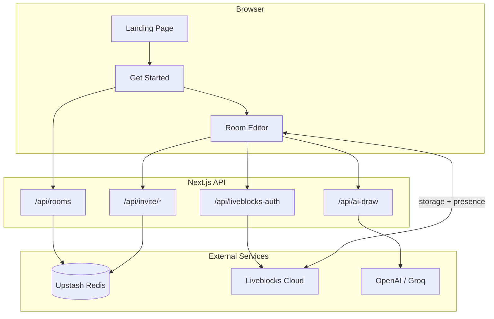
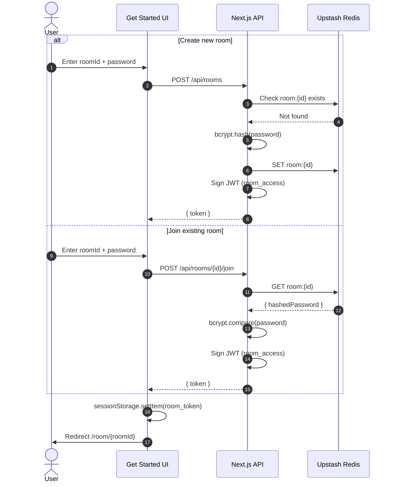
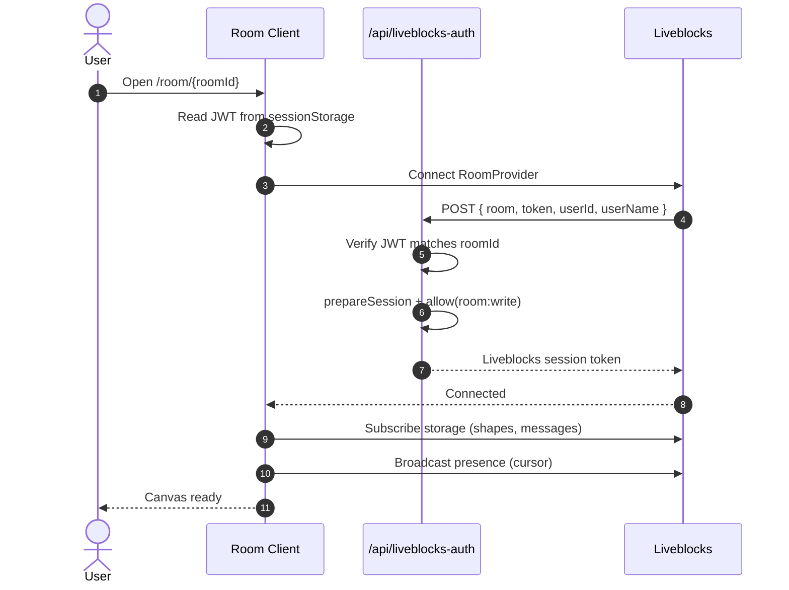
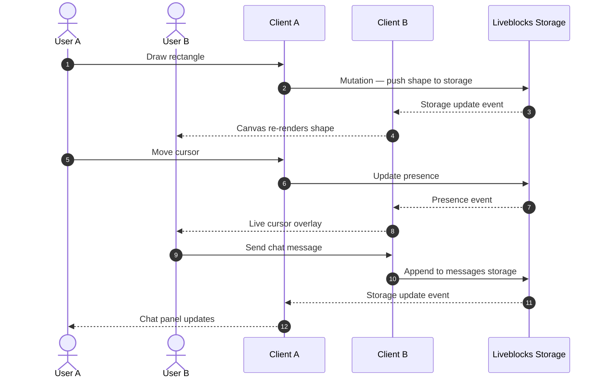
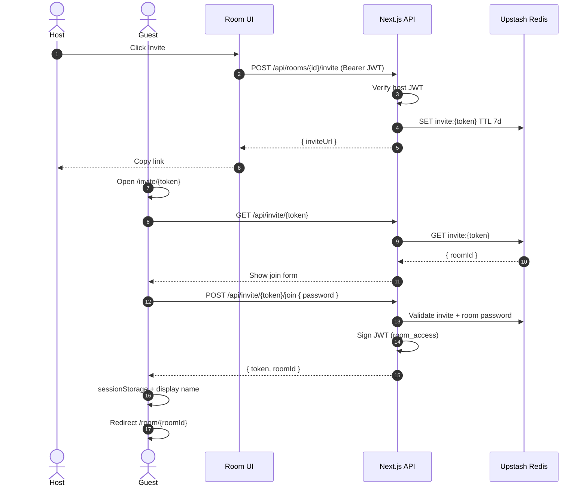
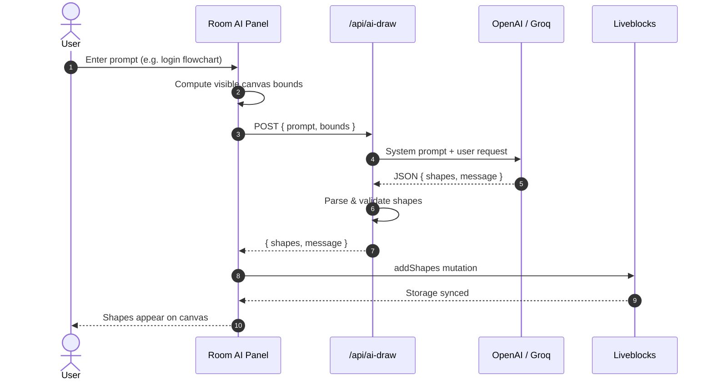
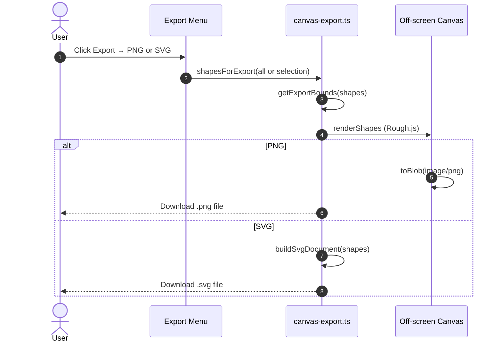

<!-- HEADER: live badges from GitHub API + package.json -->
<p align="center">
  <a href="https://github.com/subhm2004/SheetSketch">
    
  </a>
</p>

<p align="center">
  <strong>Real-time collaborative whiteboard</strong><br />
  <sub>Hand-drawn canvas · Live cursors · Secure rooms · Chat · AI draw · PNG/SVG export</sub>
</p>

<p align="center">
  <a href="https://github.com/subhm2004/SheetSketch/stargazers">
    
  </a>
  <a href="https://github.com/subhm2004/SheetSketch/network/members">
    
  </a>
  <a href="https://github.com/subhm2004/SheetSketch/commits/main">
    
  </a>
  <a href="https://github.com/subhm2004/SheetSketch">
    
  </a>
</p>

<p align="center">
  <a href="https://github.com/subhm2004/SheetSketch/blob/main/package.json">
    
  </a>
  <a href="https://github.com/subhm2004/SheetSketch/blob/main/package.json">
    
  </a>
  <a href="https://github.com/subhm2004/SheetSketch/blob/main/package.json">
    
  </a>
  <a href="https://github.com/subhm2004/SheetSketch/blob/main/package.json">
    
  </a>
  <a href="https://github.com/subhm2004/SheetSketch/blob/main/package.json">
    
  </a>
</p>

<p align="center">
  <a href="#getting-started">
    
  </a>
  <a href="https://github.com/subhm2004/SheetSketch">
    
  </a>
</p>

<p align="center">
  <a href="#getting-started"><strong>Getting Started</strong></a> ·
  <a href="#capabilities"><strong>Capabilities</strong></a> ·
  <a href="#architecture"><strong>Architecture</strong></a> ·
  <a href="#sequence-diagrams"><strong>Sequence Diagrams</strong></a> ·
  <a href="#configuration"><strong>Configuration</strong></a> ·
  <a href="#deployment"><strong>Deployment</strong></a>
</p>

<br />

---

## About

**SheetSketch** is a production-grade collaborative drawing application built with Next.js and Liveblocks. It delivers an Excalidraw-style experience: hand-drawn shapes on an infinite canvas, multiplayer sync, secure rooms, and optional AI-assisted diagram generation.

The project includes a full marketing landing page, authenticated room flows, guest invite links, in-room chat, PNG/SVG export, and light/dark theming — suitable for portfolio demos, team workshops, and as a reference implementation for realtime canvas apps.

**Repository:** [github.com/subhm2004/SheetSketch](https://github.com/subhm2004/SheetSketch)

---

## Capabilities

<details open>
<summary><strong>Canvas & drawing</strong></summary>

<br />

- Hand-drawn rendering via [Rough.js](https://roughjs.com/) — rectangles, ellipses, lines, arrows, freehand paths, and text
- Infinite canvas with pan, zoom, and view reset
- Property inspector for stroke, fill, roughness, and opacity
- Selection tool with move, resize, and delete
- Collaborative undo and redo

</details>

<details>
<summary><strong>Realtime collaboration</strong></summary>

<br />

- Live cursors with participant names and colors
- Presence avatars and active user count
- Synchronized shape and chat state across clients
- Optional visibility toggle for other users' cursors
- In-room chat with unread indicator

</details>

<details>
<summary><strong>Access & rooms</strong></summary>

<br />

- Password-protected rooms (ID + secret), stored with bcrypt hashing
- JWT-based session after join (24-hour expiry)
- Shareable invite links (7-day validity) for passwordless guest access
- Stable guest identity per browser for presence and messaging

</details>

<details>
<summary><strong>Platform features</strong></summary>

<br />

- AI diagram generation from natural language (OpenAI, with Groq fallback)
- Export to **PNG** or **SVG** — full board or selected shape
- Marketing site: features, how-to-use, FAQ, testimonials
- Light and dark theme across landing and editor
- Open-source link in navbar (`lib/site-config.ts`)

</details>

---

## Architecture

High-level view of how the browser, Next.js API routes, and external services connect.



| Component | Role |
|-----------|------|
| **Upstash Redis** | Stores room passwords (bcrypt), invite tokens (7-day TTL) |
| **Liveblocks** | Realtime shapes, chat messages, cursors, presence |
| **JWT** | Room access token in `sessionStorage` (24h expiry) |
| **OpenAI / Groq** | Optional AI shape generation from text prompts |

---

## Sequence Diagrams

End-to-end flows for the main user journeys in SheetSketch.

### 1. Create or join a room



### 2. Connect to Liveblocks (enter room)



### 3. Real-time collaboration



### 4. Invite guest to room



### 5. AI draw on canvas



### 6. Export PNG / SVG



---

## Getting Started

### Prerequisites

- Node.js 18 or later (20 recommended)
- [Liveblocks](https://liveblocks.io) account (free tier)
- [Upstash Redis](https://upstash.com) database (free tier)
- OpenAI or Groq API key *(optional, for AI draw only)*

### Installation

```bash
git clone https://github.com/subhm2004/SheetSketch.git
cd SheetSketch
npm install
cp .env.example .env.local
```

Configure `.env.local` using the [configuration reference](#configuration) below, then start the development server:

```bash
npm run dev
```

Application URL: **http://localhost:3000**

### Verify multiplayer

1. Navigate to **Get Started** and create a room (e.g. `design-review` / `your-password`).
2. Open an incognito window, join the same room.
3. Confirm live cursors, shape sync, chat, invite link, and export from the room header.

---

## Configuration

| Variable | Required | Description |
|----------|:--------:|-------------|
| `LIVEBLOCKS_SECRET_KEY` | Yes | Secret key from the Liveblocks dashboard (`sk_live_…`) |
| `UPSTASH_REDIS_REST_URL` | Yes | Upstash Redis REST endpoint |
| `UPSTASH_REDIS_REST_TOKEN` | Yes | Upstash Redis REST token |
| `JWT_SECRET` | Yes | Signing secret for room JWTs (`openssl rand -base64 32`) |
| `OPEN_AI_API_KEY` | No | OpenAI API key for AI draw |
| `GROQ_API_KEY` | No | Groq API key when OpenAI quota is unavailable |

> OpenAI API billing is separate from ChatGPT Plus. Enable billing at [platform.openai.com/settings/billing](https://platform.openai.com/settings/billing) if requests fail with quota errors.

The public GitHub URL shown in the application navbar is configured in `lib/site-config.ts` and does not require an environment variable.

---

## Development

### Scripts

| Command | Purpose |
|---------|---------|
| `npm run dev` | Start the development server (Turbopack) |
| `npm run build` | Create an optimized production build |
| `npm run start` | Serve the production build |

### Keyboard shortcuts

Available in the room editor when focus is not inside a text field:

| Key | Action |
|-----|--------|
| `V` | Select |
| `R` | Rectangle |
| `C` | Ellipse |
| `L` | Line |
| `A` | Arrow |
| `P` | Freehand |
| `T` | Text |
| `E` | Eraser |
| `Space` + drag | Pan canvas |

### Project layout

```
app/
  page.tsx                 Landing page
  get-started/             Room creation and join
  room/[roomId]/           Collaborative editor
  invite/[token]/          Guest invite flow
  api/                     REST endpoints (rooms, auth, AI, invites)

components/
  Canvas.tsx               Editor shell and header actions
  CanvasCore.tsx           Canvas rendering and input
  ExportMenu.tsx           PNG / SVG export UI
  RoomChat.tsx             Realtime chat panel
  RoomAI.tsx               AI draw interface
  LiveCursors.tsx          Multiplayer cursor overlay
  landing/                 Marketing page sections

lib/
  liveblocks.ts            Realtime client configuration
  rough-renderer.ts        Shape rendering (Rough.js)
  canvas-export.ts         Export pipeline
  ai-shapes.ts             AI prompt and response parsing
  types.ts                 Domain types
  site-config.ts           Application URLs (GitHub)

hooks/                     Canvas events, presence, chat state
```

---

## Deployment

SheetSketch targets **Vercel** or any Node.js host compatible with Next.js 16.

1. Push the repository to GitHub.
2. Import the project into your hosting provider.
3. Set all required environment variables from `.env.example`.
4. Deploy and verify Liveblocks and Upstash allow traffic from your production domain.

---

## Security

- Environment files (`.env`, `.env.local`) must not be committed.
- Room passwords are hashed with bcrypt before storage.
- JWTs expire after 24 hours; invite tokens after 7 days.
- The Liveblocks auth handler validates that the JWT room identifier matches the requested room.

---

## Roadmap

| Status | Item |
|--------|------|
| Done | Realtime canvas, cursors, and presence |
| Done | Room chat and invite links |
| Done | AI draw with provider fallback |
| Done | PNG and SVG export |
| Done | Landing page and theme system |
| Planned | JSON export and session restore |
| Planned | In-app keyboard shortcut reference |
| Planned | Enhanced mobile touch support |
| Planned | Room templates (flowchart, retro, wireframe) |

---

## Acknowledgments

- [Rough.js](https://roughjs.com/) — hand-drawn graphics
- [Liveblocks](https://liveblocks.io/) — realtime infrastructure
- [Excalidraw](https://excalidraw.com/) — inspiration for the whiteboard category (independent implementation)

---

## License

This project is intended for **education and portfolio demonstration**. SheetSketch is not affiliated with Excalidraw.

---

<p align="center">
  <sub>Built by <a href="https://github.com/subhm2004">subhm2004</a></sub>
</p>
