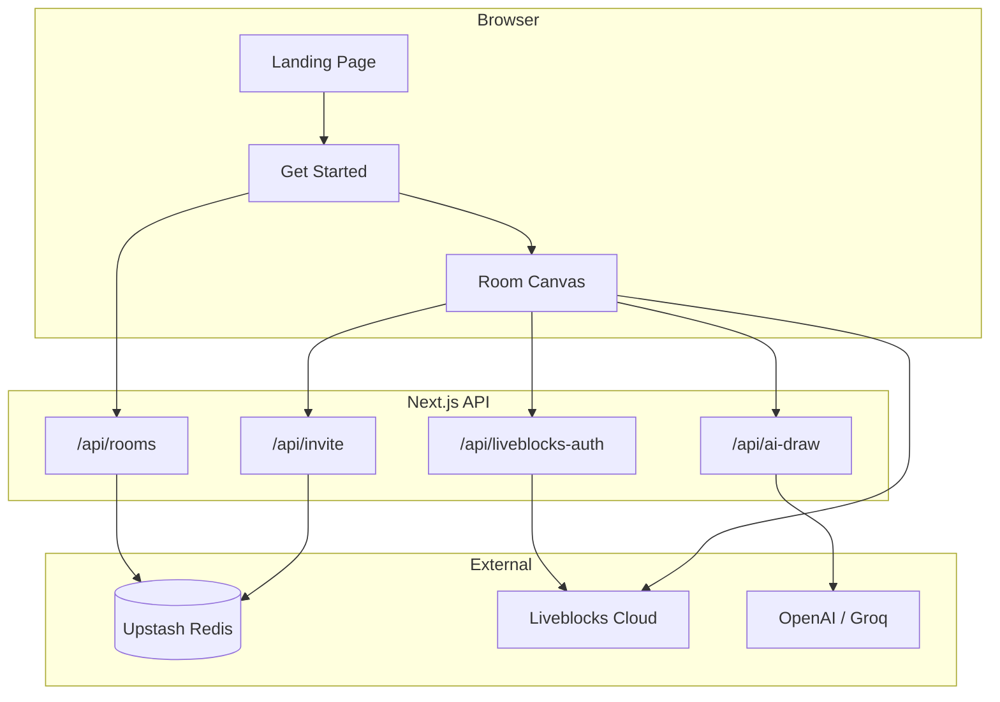

<div align="center">

# SheetSketch

### Collaborative whiteboard with a hand-drawn feel

Sketch together in real time — password-protected rooms, live cursors, room chat, AI diagrams, and PNG/SVG export.  
No install. No signup. Just open the browser and draw.

<br />

[](https://github.com/subhm2004/SheetSketch)
[](https://nextjs.org/)
[](https://react.dev/)
[](https://www.typescriptlang.org/)
[](https://liveblocks.io/)
[](https://roughjs.com/)

<br />

**[Live demo](#-quick-start)** · **[Features](#-features)** · **[How it works](#-how-it-works)** · **[Setup](#-quick-start)** · **[Deploy](#-deployment)**

<br />

```
   Landing          Get Started           Room Canvas
 ┌──────────┐      ┌─────────────┐      ┌────────────────────────┐
 │  Hero    │  →   │ Create/Join │  →   │ Draw · Chat · AI · Export│
 │ Features │      │ Room + Pass │      │ Live cursors · Invite   │
 └──────────┘      └─────────────┘      └────────────────────────┘
```

</div>

---

## Table of contents

- [Why SheetSketch?](#why-sheetsketch)
- [Features](#-features)
- [Screenshots](#-screenshots)
- [How it works](#-how-it-works)
- [Quick start](#-quick-start)
- [Environment variables](#-environment-variables)
- [Keyboard shortcuts](#-keyboard-shortcuts)
- [Project structure](#-project-structure)
- [Tech stack](#-tech-stack)
- [Deployment](#-deployment)
- [Security](#-security)
- [Roadmap](#-roadmap)
- [License](#-license)

---

## Why SheetSketch?

**SheetSketch** is a full-stack collaborative drawing app inspired by tools like Excalidraw. It is built for:

- **Brainstorming** with your team in a private room  
- **Wireframes** and quick diagrams without heavy design tools  
- **Teaching** and whiteboarding in the browser  
- **Remote collaboration** with cursors, chat, and instant sync  

Unlike a static mockup, SheetSketch is a **real product**: rooms, auth, invites, realtime storage, optional AI, export, and a polished marketing landing page.

---

## ✨ Features

### Drawing & canvas

| | Feature | What you get |
|---|--------|----------------|
| ✏️ | **Hand-drawn shapes** | Rectangles, ellipses, lines, arrows, freehand & text via [Rough.js](https://roughjs.com/) |
| 🖱️ | **Infinite canvas** | Pan, zoom (+/−), reset view — never run out of space |
| 🎛️ | **Properties panel** | Stroke, fill, roughness, opacity; edit selected shapes |
| ↩️ | **Undo / redo** | Collaborative history (Liveblocks) |
| 🧹 | **Eraser & select** | Move, resize, delete shapes |

### Real-time collaboration

| | Feature | What you get |
|---|--------|----------------|
| 👆 | **Live cursors** | Colored cursors + names; toggle others on/off |
| 👥 | **Presence** | Avatars & online count in the room header |
| 💬 | **Room chat** | Side panel + unread dot when chat is closed |
| ⚡ | **Instant sync** | Shapes & messages sync across all clients |

### Rooms & security

| | Feature | What you get |
|---|--------|----------------|
| 🔐 | **Password rooms** | Room ID + password; bcrypt-hashed in Redis |
| 🔗 | **Invite links** | 7-day guest links — join with name only |
| 🎫 | **JWT sessions** | 24h room token after join |
| 👤 | **Guest ID** | Stable per-browser identity for chat & presence |

### Export & AI

| | Feature | What you get |
|---|--------|----------------|
| 📥 | **Export PNG / SVG** | Download full board or selected shape from the room header |
| 🤖 | **AI draw** | Describe a diagram → shapes appear on canvas (OpenAI or Groq) |

### App experience

| | Feature | What you get |
|---|--------|----------------|
| 🏠 | **Landing page** | Hero, features, how-to-use, discover, testimonials, FAQ |
| 🌓 | **Light / Dark theme** | Toggle in navbar, canvas, and footer |
| 📱 | **Responsive UI** | Toolbar, properties panel, mobile-friendly header |
| ⭐ | **GitHub link** | Navbar button → [github.com/subhm2004/SheetSketch](https://github.com/subhm2004/SheetSketch) |

---

## 📸 Screenshots

> Add your own images under `/public/readme/` and uncomment the lines below.

<!--
| Landing | Room |
|---------|------|
|  |  |
-->

**Suggested captures:** landing hero · room with shapes · live cursors · chat panel · export menu · AI draw

---

## 🔄 How it works



| Step | What happens |
|------|----------------|
| **1** | User creates or joins a room → API checks password → returns JWT |
| **2** | Client calls Liveblocks auth → session scoped to that `roomId` |
| **3** | Drawing & chat write to Liveblocks storage → all clients update live |
| **4** | Invite link lets guests skip password and join with display name only |
| **5** | Export renders shapes off-screen → PNG or SVG download |

---

## 🚀 Quick start

### Prerequisites

| Requirement | Notes |
|-------------|--------|
| **Node.js 18+** | 20+ recommended |
| **Liveblocks** | Free tier — [liveblocks.io](https://liveblocks.io) |
| **Upstash Redis** | Free tier — [upstash.com](https://upstash.com) |
| **OpenAI or Groq** | Optional — only for AI draw |

### 1. Clone the repository

```bash
git clone https://github.com/subhm2004/SheetSketch.git
cd SheetSketch
npm install
```

### 2. Configure environment

```bash
cp .env.example .env.local
```

Open `.env.local` and fill in the values (see table below).

### 3. Start development server

```bash
npm run dev
```

Open **http://localhost:3000**

### 4. Test collaboration

1. Click **Get Started** → create a room (`my-team` / `secret123`)
2. Open **another browser or incognito** → join same room
3. Draw together — watch **live cursors** move
4. Open **Chat**, copy an **Invite** link, try **AI draw**, **Export PNG**

---

## 🔑 Environment variables

| Variable | Required | Description |
|----------|:--------:|-------------|
| `LIVEBLOCKS_SECRET_KEY` | ✅ | Liveblocks secret key (`sk_live_...`) from dashboard |
| `UPSTASH_REDIS_REST_URL` | ✅ | Upstash Redis REST URL |
| `UPSTASH_REDIS_REST_TOKEN` | ✅ | Upstash Redis REST token |
| `JWT_SECRET` | ✅ | Random secret — e.g. `openssl rand -base64 32` |
| `OPEN_AI_API_KEY` | ⬜ | OpenAI API key for AI draw |
| `GROQ_API_KEY` | ⬜ | Free fallback when OpenAI has no quota |

> **Important:** ChatGPT Plus is **not** the same as OpenAI API billing. Add credits at [platform.openai.com/settings/billing](https://platform.openai.com/settings/billing) if AI draw returns quota errors.

**GitHub URL** for the navbar button is set in `lib/site-config.ts` — no env variable needed.

---

## ⌨️ Keyboard shortcuts

In the room canvas (when not typing in a text field):

| Key | Tool |
|-----|------|
| `V` | Select |
| `R` | Rectangle |
| `C` | Ellipse |
| `L` | Line |
| `A` | Arrow |
| `P` | Freehand |
| `T` | Text |
| `E` | Eraser |

Hold **Space** + drag to pan the canvas.

---

## 📁 Project structure

```
SheetSketch/
├── app/
│   ├── page.tsx                    # Landing (hero, features, FAQ, …)
│   ├── get-started/                # Create / join room
│   ├── room/[roomId]/              # Main whiteboard
│   ├── invite/[token]/             # Guest invite flow
│   └── api/
│       ├── rooms/                  # Create & join
│       ├── liveblocks-auth/        # Liveblocks session
│       ├── invite/                 # Invite tokens
│       └── ai-draw/                # AI shape generation
├── components/
│   ├── Canvas.tsx                  # Room shell (header, export, chat, AI)
│   ├── CanvasCore.tsx              # Drawing engine + canvas
│   ├── ExportMenu.tsx              # PNG / SVG export
│   ├── RoomChat.tsx                # Real-time chat
│   ├── RoomAI.tsx                  # AI draw panel
│   ├── LiveCursors.tsx             # Multiplayer cursors
│   ├── ThemeToggle.tsx             # Light / dark
│   └── landing/                    # Marketing sections
├── lib/
│   ├── liveblocks.ts               # Client & room config
│   ├── types.ts                    # Shapes, tools, presence
│   ├── rough-renderer.ts           # Rough.js rendering
│   ├── canvas-export.ts            # PNG & SVG export
│   ├── ai-shapes.ts                # AI prompts & parsing
│   └── site-config.ts              # GitHub URL (navbar)
└── hooks/                          # Cursors, chat unread, canvas events
```

---

## 🏗 Tech stack

| Layer | Technology |
|-------|------------|
| **Framework** | [Next.js 16](https://nextjs.org/) — App Router, Turbopack |
| **UI** | React 19, Tailwind CSS 4, Framer Motion |
| **Drawing** | Rough.js + HTML Canvas |
| **Realtime** | [Liveblocks](https://liveblocks.io/) — presence, storage, broadcast |
| **Database** | [Upstash Redis](https://upstash.com/) — rooms & invites |
| **Auth** | JWT + bcrypt |
| **AI** | OpenAI API (+ optional Groq fallback) |

---

## 🛠 Scripts

| Command | Description |
|---------|-------------|
| `npm run dev` | Development server (http://localhost:3000) |
| `npm run build` | Production build |
| `npm run start` | Run production server |

---

## 🌐 Deployment

Deploy on **[Vercel](https://vercel.com)** (recommended), Railway, or any Node host supporting Next.js 16.

1. Push code to [github.com/subhm2004/SheetSketch](https://github.com/subhm2004/SheetSketch)
2. Import project on Vercel
3. Add all **required** env vars from `.env.example`
4. Deploy

Allow your production domain in Liveblocks & Upstash if you use access restrictions.

---

## 🔒 Security

- Never commit `.env` or `.env.local` — they are gitignored  
- Room passwords are **bcrypt-hashed** in Redis  
- JWTs expire after **24 hours**  
- Invite tokens expire after **7 days**  
- Liveblocks auth verifies JWT `roomId` matches the requested room  

---

## 🗺 Roadmap

- [x] Real-time drawing & cursors  
- [x] Room chat & invite links  
- [x] AI draw (OpenAI + Groq)  
- [x] Export PNG / SVG  
- [x] Landing page + light/dark theme  
- [ ] Export to JSON / restore sessions  
- [ ] Keyboard shortcuts help modal  
- [ ] Mobile touch improvements  
- [ ] Room templates (flowchart, retro, wireframe)  

---

## 📄 License

This project is for **learning and portfolio use**.  
Excalidraw is a separate product — SheetSketch is an independent implementation inspired by the collaborative whiteboard category.

---

<div align="center">

**SheetSketch** — sketch together, ship faster

<br />

[](https://github.com/subhm2004/SheetSketch)

Made with care by **[subhm2004](https://github.com/subhm2004)**

[⬆ Back to top](#sheetsketch)

</div>
